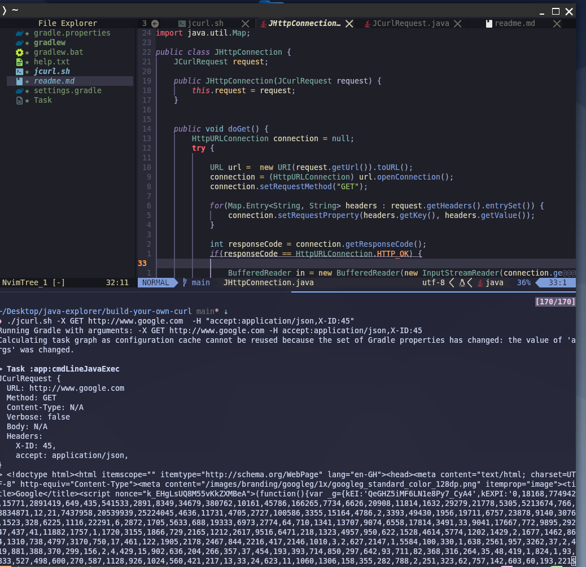

# Custom Curl Utility (JCurl)

The JCurl utility is a Java-based HTTP client that allows users to send HTTP requests (GET, POST, etc.) with customizable headers, content types, and other parameters, through a simple shell wrapper and Gradle-based execution.

This project includes a core Java application to handle HTTP requests and a shell script (jcurl.sh) to simplify the interaction with the utility.

## Overview
The JCurl utility is designed to emulate the basic functionality of curl commands in a simple and extendable way using Java. This utility allows sending various HTTP requests (GET, POST, PUT, etc.) and includes a shell wrapper (jcurl.sh) for easy integration with Gradle.


#### Key Features:
- Supports HTTP methods like GET, POST, PUT, and others.
- Allows the addition of custom headers with the -H option.
- Can specify a request body for POST and PUT requests.
- Provides a convenient shell script wrapper for Gradle integration.

### Core Components

- ***JCurlCommandClient*** : JCurlCommandClient is the core class that decides the type of HTTP request (GET, POST, etc.) based on the arguments provided. It delegates the actual HTTP execution to a method that matches the request type.

> Main Method: execute() - Decides which HTTP method to call (GET, POST, etc.) based on input.
Delegates: Calls appropriate methods (e.g., doGet(), doPost()) to handle the HTTP request.

- ***JCurlParser*** :
JCurlParser is responsible for parsing command-line arguments passed to the utility. It converts the raw input into a JCurlRequest object that holds the necessary details for making the HTTP request (method, headers, URL, etc.).*

> Main Method: parseArgs(String[] args) - Converts raw arguments into a JCurlRequest object.

- ***JCurlRequest*** :
The JCurlRequest object holds the details of the request:

    - URL: The target URL for the HTTP request.
    - Method: The HTTP method (GET, POST, PUT, etc.).
    - Headers: A map of custom headers (-H "key:value").
    - Body: The request body for POST and PUT requests.

- ***JCurlResponse***
The JCurlResponse class handles the response returned from the server, logging either a success message or an error message depending on the HTTP status code.

> Methods: Logs the status code and any response body.


# How to Run
There are two main ways to run the JCurl utility:

## Running with Gradle
You can execute the utility via Gradle using the cmdLineJavaExec task. This method requires passing arguments using -Pargs property tags.

Example:
```bash
./gradlew cmdLineJavaExec -Pargs="-X GET http://www.google.com"
```
This command will use Gradle to execute the Java program and send a GET request to the specified URL.


## Running with Shell Wrapper
You can also run the utility directly using the jcurl.sh script. This script is a simple wrapper that allows you to execute the utility with arguments just like using the curl command in the terminal.

Example:
```bash
./jcurl.sh -X GET http://www.google.com -H "accept:application/json" -H "X-ID:45"
```
This command sends a GET request to http://www.google.com, with custom headers for accept and X-ID.

### Usage Examples
> Sending a GET Request
You can send a GET request with the following:

***With Gradle:***
```bash
./gradlew cmdLineJavaExec -Pargs="-X GET http://www.google.com"
```

***With Shell Wrapper:***
```bash
./jcurl.sh -X GET http://www.google.com
```


#### Sending a POST Request with Headers
For a POST request with a JSON body and custom headers, use:

***With Gradle:***
```bash
./gradlew cmdLineJavaExec -Pargs="-X POST http://www.example.com -H \"Content-Type:application/json\" -H \"Authorization: Bearer YOUR_TOKEN\" -d \"{\\\"key\\\": \\\"value\\\"}\""
```

***With Shell Wrapper:***
```bash
./jcurl.sh -X POST http://www.example.com -H "Content-Type:application/json" -H "Authorization:Bearer YOUR_TOKEN" -d '{"key": "value"}'
```



