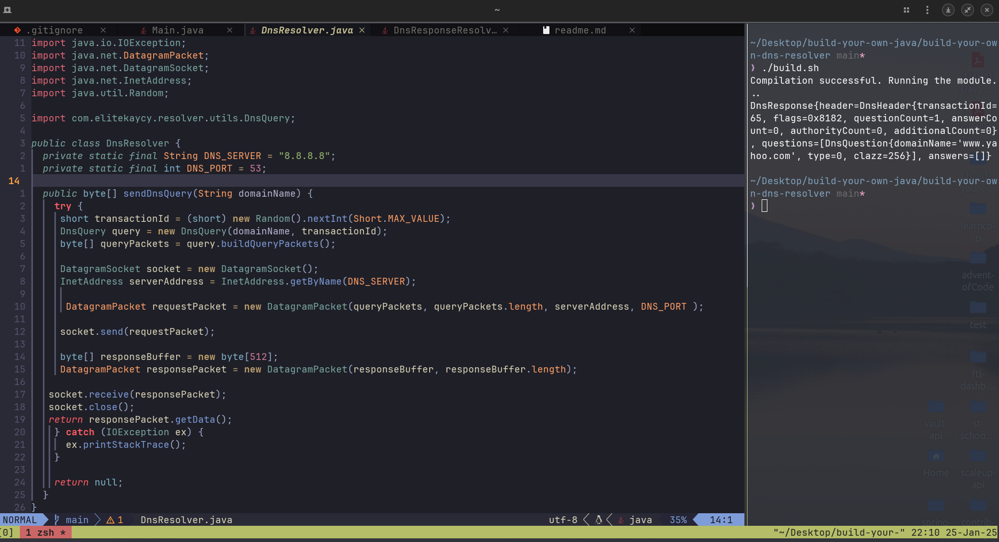

# Building a DNS Resolver in Java

## Introduction

A Domain Name System (DNS) resolver translates human-readable domain names (e.g., `example.com`) into IP addresses (e.g., `93.184.216.34`) that computers use to communicate. DNS resolvers play a crucial role in the internet's infrastructure, enabling web browsing, email delivery, and much more.

This guide will walk you through building a simple DNS resolver in Java. By the end of this tutorial, you'll understand:

1. What a DNS resolver does.
2. How to construct DNS query packets.
3. Why DNS packets are structured in a specific way.
4. How to send queries to a DNS server and parse responses.
5. How to structure the resolver into reusable components.

---

## Why Do We Build Packets This Way?

DNS packets must conform to the DNS protocol, which ensures interoperability between resolvers and servers worldwide. The packet structure includes the following key components:

- **Header**: Contains metadata about the query, such as an identifier (transaction ID), flags (e.g., query type), and the number of questions, answers, and other records.
- **Question**: Specifies the domain name being queried, the type of record requested (e.g., A, AAAA, MX), and the class of the query (usually IN for internet).
- **Answer**: When returned, contains the resolved IP address or other requested data.

Each field in the DNS packet has a precise position and size, making it crucial to follow the protocol to ensure proper communication with DNS servers.

---

## Prerequisites

To follow along, you should have:

- Basic knowledge of Java programming.
- Java Development Kit (JDK) installed.
- An IDE or text editor of your choice.

---

## Step-by-Step Guide

### 1. Create the Project Structure

Organize the project as follows:

```plaintext
src/main/java/com/elitekaycy/resolver
  |-- DnsResolver.java
  |-- utils
       |-- DnsQuery.java
       |-- DnsResolver.java
       |-- DnsResponseResolver.java
       |-- DnsCacheEntry.java
```

### 2. Constructing DNS Query Packets

DNS queries follow a specific binary structure. Each query includes:

- **Header**: Metadata about the query.
- **Question**: The domain name being queried and the query type (e.g., A record for IPv4).

Here's the `DnsQuery` class:

```java
package com.elitekaycy.resolver.utils;

import java.nio.ByteBuffer;
import java.util.Random;

public class DnsQuery {
    private final String domainName;
    private final short transactionId;

    public DnsQuery(String domainName, short transactionId) {
        this.domainName = domainName;
        this.transactionId = transactionId;
    }

    public byte[] buildQueryPackets() {
        ByteBuffer buffer = ByteBuffer.allocate(512);
        buffer.putShort(transactionId); // Transaction ID
        buffer.putShort((short) 0x0100); // Standard query
        buffer.putShort((short) 1); // One question
        buffer.putShort((short) 0); // No answers
        buffer.putShort((short) 0); // No authority
        buffer.putShort((short) 0); // No additional

        // Encode domain name
        for (String part : domainName.split("\\.")) {
            buffer.put((byte) part.length());
            buffer.put(part.getBytes());
        }
        buffer.put((byte) 0); // End of domain name

        buffer.putShort((short) 1); // Query type: A
        buffer.putShort((short) 1); // Query class: IN

        return buffer.array();
    }
}
```

---

### 3. Sending the Query and Receiving the Response

Create a method to send the query to a DNS server (e.g., Google's `8.8.8.8`) and retrieve the response.

```java
package com.elitekaycy.resolver;

import com.elitekaycy.resolver.utils.DnsQuery;
import java.io.IOException;
import java.net.*;
import java.util.Random;

public class DnsResolver {
    private static final String DNS_SERVER = "8.8.8.8";
    private static final int DNS_PORT = 53;

    public byte[] sendDnsQuery(String domainName) {
        try {
            short transactionId = (short) new Random().nextInt(Short.MAX_VALUE);
            DnsQuery query = new DnsQuery(domainName, transactionId);
            byte[] queryPackets = query.buildQueryPackets();

            DatagramSocket socket = new DatagramSocket();
            InetAddress serverAddress = InetAddress.getByName(DNS_SERVER);

            DatagramPacket requestPacket = new DatagramPacket(queryPackets, queryPackets.length, serverAddress, DNS_PORT);
            socket.send(requestPacket);

            byte[] responseBuffer = new byte[512];
            DatagramPacket responsePacket = new DatagramPacket(responseBuffer, responseBuffer.length);
            socket.receive(responsePacket);
            socket.close();

            return responsePacket.getData();
        } catch (IOException ex) {
            ex.printStackTrace();
        }

        return null;
    }
}
```

---

### 4. Parsing the DNS Response

The response includes a header, question, and answer sections. We'll extract the IP address from the answer section.

Here's the `DnsResponseParser` class:

```java
package com.elitekaycy.resolver.utils;

import java.net.InetAddress;
import java.net.UnknownHostException;
import java.nio.ByteBuffer;

public class DnsResponseResolver {
    public static DnsResponse parseDnsResponse(byte[] response) throws UnknownHostException {
        ByteBuffer buffer = ByteBuffer.wrap(response);
        buffer.position(12); // Skip header

        // Skip the question section
        while (buffer.get() != 0) {}
        buffer.position(buffer.position() + 4); // Skip QTYPE and QCLASS

        // Parse the answer section
        buffer.position(buffer.position() + 10); // Skip name, type, class, and TTL
        short dataLength = buffer.getShort();

        byte[] ipBytes = new byte[dataLength];
        buffer.get(ipBytes);

        InetAddress ipAddress = InetAddress.getByAddress(ipBytes);
        return new DnsResponse(ipAddress.getHostAddress());
    }
}
```

Define the `DnsResponse` object:

```java
package com.elitekaycy.resolver.utils.DnsResponseResolver;

 public static record DnsResponse(
      DnsHeader header, List<DnsQuestion> questions, List<DnsAnswer> answers) {

    @Override
    public String toString() {
      return "DnsResponse{"
          + "header="
          + header
          + ", questions="
          + questions
          + ", answers="
          + answers
          + '}';
    }
  }
```

---

### 5. Testing the Resolver

Finally, create a `main` method to test the DNS resolver:

```java
package com.elitekaycy.resolver;

import com.elitekaycy.resolver.utils.DnsResponse;
import com.elitekaycy.resolver.utils.DnsResponseResolver;

public class Main {

  public static void main(String[] args) throws UnknownHostException {

    DnsResolver resolver = new DnsResolver();
    String domainName = "www.yahoo.com";

    byte[] response = resolver.sendDnsQuery(domainName);
    DnsResponse parsedResponse = DnsResponseResolver.parse(response);
    System.out.println(parsedResponse);
  }
}
```





