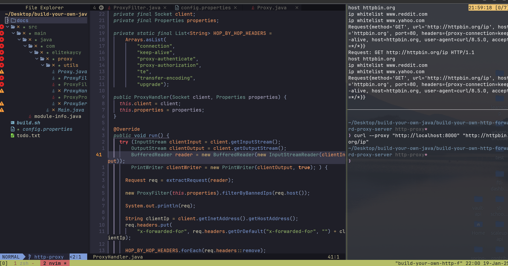

# HTTP Forward Proxy

This document provides an overview of the HTTP Forward Proxy implementation, what it is, how it works, and how to run the proxy. The proxy is designed to forward HTTP requests to a destination server, modify the request and response as needed, and handle various operations such as removing hop-by-hop headers, modifying GET requests, and adding the X-Forwarded-For header.

## What is an HTTP Forward Proxy?

An HTTP Forward Proxy acts as an intermediary between a client and a destination server. When a client sends an HTTP request, it is first received by the forward proxy, which can:

- Modify or inspect the request (hide ip, etc).
- Forward the request to the intended destination server.
- Receive the response from the server.
- Pass the modified response back to the client.

This kind of proxy is often used for caching, filtering, logging, and anonymizing traffic.

## Implementation Details

### ProxyServer Code Overview

***Listening for Client Connections:***
The proxy server listens for incoming connections on a specified port and accepts client connections.
```java
    try (ServerSocket serverSocket = new ServerSocket(this.port)) {
      while (true) {
        Socket client = serverSocket.accept();
        new Thread(new ProxyHandler(client, this.properties)).start();
      }
    } catch (IOException ignored) {}
```


***Reading and Parsing Requests:***
The proxy reads the HTTP request from the client, parses the request line, headers, and body, and determines the destination server.
```java
private Request extractRequest(BufferedReader reader) throws IOException {
    String requestLine = reader.readLine();
 
    String[] requestPaths = requestLine.split(" ");
    String method = requestPaths[0];
    String url = requestPaths[1];

    Map<String, String> reqHeaders = new HashMap<>();
    String host = null;
    int port = 80;
    String line;

    while (!(line = reader.readLine()).isEmpty()) {
      int seperator = line.indexOf(":");

        String headerName = line.substring(0, seperator).trim().toLowerCase();
        String headerValue = line.substring(seperator + 1).trim().toLowerCase();
        reqHeaders.put(headerName, headerValue);

        if (headerName.equals("host")) {
          host = headerValue.contains(":") ? headerValue.split(":")[0] : headerValue;
          port = headerValue.contains(":") ? Integer.parseInt(headerValue.split(":")[1]) : 80;
      }
      
      return new Request(method, url, host, port, reqHeaders);
    }


```

***Removing Hop-by-Hop Headers:***
The server removes headers like Connection, Keep-Alive, and others before forwarding the request.
```java
private static final List<String> HOP_BY_HOP_HEADERS =
      Arrays.asList(
          "connection",
          "keep-alive",
          "proxy-authenticate",
          "proxy-authorization",
          "te",
          "transfer-encoding",
          "upgrade");
          
HOP_BY_HOP_HEADERS.forEach(req.headers::remove);
```

***Adding the X-Forwarded-For Header:***
The server appends the client’s IP address to the X-Forwarded-For header.
```java
String clientIp = client.getInetAddress().getHostAddress();
req.headers.put("x-forwarded-for", req.headers.getOrDefault("x-forwarded-for", "") + clientIp);
```

***Filtering the request***
The server filters request ips from blacklist based on properties passed
```java
  public void filterByBannedIps(String host) {
    String[] ipWhitelist = properties.getProperty("banned.ips").split(",");
    System.out.println("host " + host);
    for (String ip : ipWhitelist) {
      System.out.println("ip whitelist " + ip);
      if (host.equals(ip)) {
        throw new ProxyFilterException("blocked Ip " + ip);
      }
    }
  }

```

Forwarding the Request:
The proxy establishes a connection to the destination server, sends the modified request, and retrieves the response.
```java
private void forwardRequest(Request request, PrintWriter writer) throws IOException {
    try (Socket destination = new Socket(request.host(), request.port());
        InputStream destInput = destination.getInputStream();
        OutputStream destOutput = destination.getOutputStream();
        BufferedWriter destWriter = new BufferedWriter(new OutputStreamWriter(destOutput));
        BufferedReader destReader = new BufferedReader(new InputStreamReader(destInput)); ) {

      try {
        destWriter.write(request.method() + " " + request.url() + " HTTP/1.1\r\n");
        request
            .headers()
            .forEach(
                (key, value) -> {
                  try {
                    destWriter.write(key + ": " + value + "\r\n");
                  } catch (IOException ignored) {
                  }
                });

        destWriter.write("\r\n");
        destWriter.flush();
      } catch (IOException ignored) {
      }
      String line;
      while ((line = destReader.readLine()) != null) {
        writer.println(line);
      }

    } catch (IOException ignored) {
    }
  }

```


## How to Run the Proxy

#### Setup and Execution

**Clone the Repository:**
```git
git clone https://github.com/elitekaycy/java-explorer
cd build-your-own-http-forward-proxy-server 
```

**Run the Proxy (contains the compile and build script):**
```
./build.sh
```

**Test the Proxy:**
Send an HTTP request to the proxy. For example, using curl:
```bash
curl --proxy "http://localhost:8000" "http://httpbin.org/ip" -v;
```

Example Output




## Further Advancement
- Still having issues making the proxy work for build-your-own-http-forward-proxy-server
```
error
* OpenSSL SSL_connect: SSL_ERROR_SYSCALL in connection to httpbin.org:443
* Closing connection
curl: (35) OpenSSL SSL_connect: SSL_ERROR_SYSCALL in connection to httpbin.org:443

```
