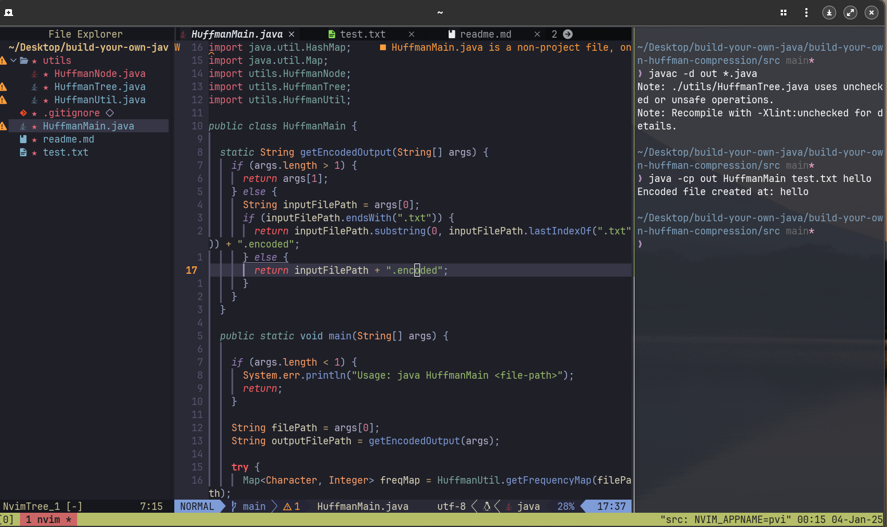

# Huffman Encoding and Decoding

### What is Compression?

Compression is the process of reducing the size of data, typically to save space or transmission time. Huffman encoding is a lossless compression algorithm that assigns variable-length codes to input characters, with shorter codes assigned to more frequent characters. The goal is to reduce the overall size of the data by using fewer bits for more common characters.

**Huffman Encoding and Decoding**

Huffman encoding works by creating a binary tree, where each character of the input data is assigned a unique binary code. The more frequent characters are assigned shorter binary codes, and the less frequent ones are assigned longer codes.

Steps for Huffman Encoding:

**Frequency Analysis:** Count the frequency of each character in the input data.
```java
 public static Map<Character, Integer> getFrequencyMap(String file) {
    Map<Character, Integer> freqMap = new HashMap<>();
    
    try (BufferedReader bf = new BufferedReader(new FileReader(file))) {
      String line;
      while ((line = bf.readLine()) != null) {
        for (char ch : line.toCharArray()) {
          freqMap.put(ch, freqMap.getOrDefault(ch, 0) + 1);
        }
      }
    } catch (IOException e) { e.printStackTrace(); }

    return freqMap;
  }
```

**Build the Huffman Tree:** Construct a binary tree where each leaf node represents a character and its frequency. The two least frequent nodes are merged recursively to build the tree.

```java
  public static HuffmanNode buildTree(Map<Character, Integer> freqMap) {
    PriorityQueue<HuffmanNode> pq = new PriorityQueue<>();

    for (Map.Entry<Character, Integer> fm : freqMap.entrySet()) {
      pq.add(new HuffmanNode(fm.getKey(), fm.getValue()));
    }

    while (pq.size() > 1) {
      HuffmanNode left = pq.poll();
      HuffmanNode right = pq.poll();
      HuffmanNode internalNode = new HuffmanNode(left.frequency + right.frequency, left, right);
      pq.add(internalNode);
    }

    return pq.poll();
  }
```
**Generate Huffman Codes:** Assign binary codes to characters based on their position in the tree. Characters closer to the root will have shorter codes.

```java
  public static void generateCodes(HuffmanNode root, String code, Map<Character, String> codeMap) {
    if (root == null) return;

    if (root.left == null && root.right == null) {
      codeMap.put(root.character, code);
    } else {
      generateCodes(root.left, code + "0", codeMap);
      generateCodes(root.right, code + "1", codeMap);
    }
  }
```

**Encode the Data:** Replace each character in the input data with its corresponding Huffman code.

```java
public static String encode(String input, Map<Character, String> codeMap) {
    String txt = "";
    try {

      txt = new String(Files.readAllBytes(Paths.get(input)));
    } catch (IOException ignored) {
    }
    StringBuilder result = new StringBuilder();
    for (char inp : txt.toCharArray()) {
      result.append(codeMap.get(inp));
    }
    return result.toString();
  }
 ```
 
*Once Complete We write to a file both encoding and decoding. [more](./src/utils/HuffmanTree.java)*
 ```java
 public static void writeEncodedFile(String filePath, Map<Character, Integer> freqMap, String encodedString)
 
 public static String decodeFromFile(String filePath)
 ```
 

### Steps for Huffman Decoding:

- **Read Encoded Data:** Read the encoded string and the frequency map stored in a file.
- **Reconstruct the Huffman Tree:**  Use the frequency map to rebuild the Huffman tree.
- **Decode the Data:** Traverse the Huffman tree using the encoded bits to reconstruct the original input data.

```java
  public static String decode(String encodedString, HuffmanNode root) {
    StringBuilder decodedString = new StringBuilder();
    HuffmanNode currentNode = root;

    for (char bit : encodedString.toCharArray()) {
      currentNode = (bit == '0') ? currentNode.left : currentNode.right;

      if (currentNode.left == null && currentNode.right == null) {
        decodedString.append(currentNode.character);
        currentNode = root;
      }
    }

    return decodedString.toString();
  }
```

## Steps to Run the Code

**1. Compile the Code**

To compile the code, navigate to the src directory where your .java files are located and execute the following command:

```java
javac -d out *.java
```

This will compile all the Java files in the current directory and place the class files in the out directory.

**2. Running the Program**

To run the program, use the following command:

```java
java -cp out HuffmanMain <inputFilePath> <outputFilePath>
```

Where:

    <inputFilePath> is the path to the text file you want to compress.
    <outputFilePath> is the path where the encoded file will be saved.


***Example Usage:***

If you have a text file named input.txt and want the encoded output to be saved as output.encoded, run the following command:

```java
java -cp out HuffmanMain input.txt output.encoded
```

This will:

    Read the input file input.txt.
    Perform Huffman encoding and generate the encoded output.
    Save the encoded file with the frequency map and encoded string to output.encoded.

3. Decoding the Encoded File

To decode the encoded file, you can call the decodeFromFile method in the HuffmanTree class with the file path of the encoded file.

Example:

```java
String decodedString = HuffmanTree.decodeFromFile("output.encoded");
System.out.println("Decoded String: " + decodedString);
```

This will:

    Read the frequency map and encoded string from the encoded file.
    Rebuild the Huffman tree.
    Decode the encoded string and print the original content.

Code Structure
Classes:
```
HuffmanTree: Contains methods for building the Huffman tree, generating Huffman codes, encoding, decoding, and saving/loading the encoded data to/from files.
HuffmanNode: A class representing a node in the Huffman tree.
HuffmanMain: The main class that runs the program, accepts file paths, and manages the encoding and decoding process.
```

Methods:
```
buildTree(Map<Character, Integer> freqMap) - Builds the Huffman tree using a frequency map.
generateCodes(HuffmanNode root, String code, Map<Character, String> codeMap) - Recursively generates Huffman codes for each character.
encode(String input, Map<Character, String> codeMap) - Encodes the input string using the Huffman codes.
decode(String encodedString, HuffmanNode root) - Decodes the encoded string using the Huffman tree.
writeEncodedFile(String filePath, Map<Character, Integer> freqMap, String encodedString) - Writes the encoded string and frequency map to a file.
decodeFromFile(String filePath) - Decodes a previously encoded file by reading the frequency map and encoded string, then rebuilding the Huffman tree.
```

;
