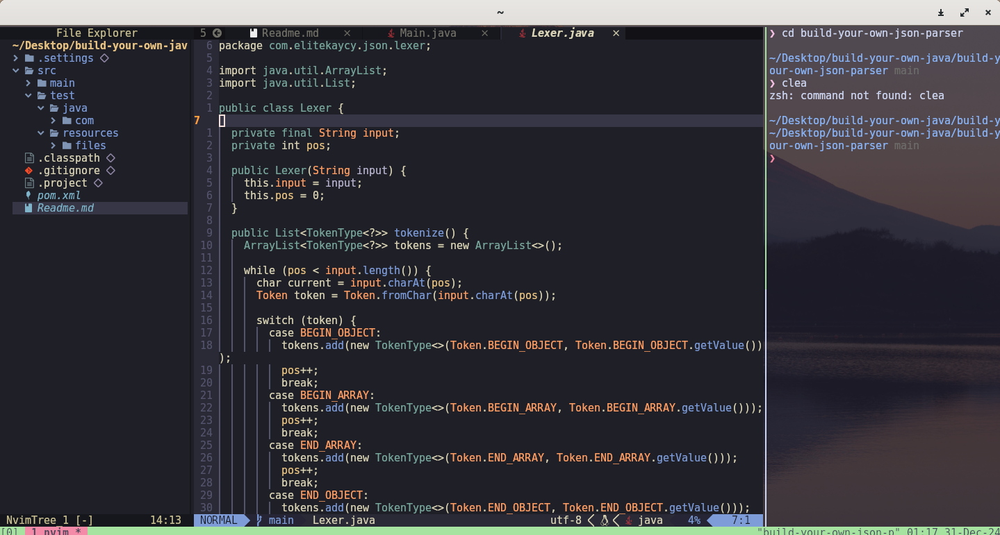

# JSON Parser

This project implements a JSON parser in Java that converts JSON strings into Java objects and vice versa. It follows the stages of lexical analysis, syntactic analysis, and object creation. Additionally, the project explores using reflections to convert Java objects to JSON.


## Overview

The JSON Parser project is designed to take a JSON string as input, process it through lexical analysis, syntactic analysis, and finally parse it into Java objects. The parser uses a custom tokenizer and syntax analyzer to break down the JSON data into meaningful objects such as JsonObject, JsonArray, JsonString, JsonNumber, JsonBoolean, and JsonNull.
Features

**Lexical Analysis:** Tokenizes `JSON` strings into meaningful components like `strings`, `numbers`, `objects`, and `arrays`.

**Syntactic Analysis:** Uses the tokens generated from lexical analysis to build a tree structure representing the JSON data.

**JSON Object Creation:** Converts the parsed JSON structure into Java objects like JsonObject and JsonArray.

**Reflection-based Conversion:** Leverages Java Reflection to convert Java objects to JSON.

##  Architecture
### Lexical Analysis

The first stage of the JSON parsing process involves lexical analysis, where the raw JSON string is converted into tokens. These tokens include:

```java
BEGIN_OBJECT: {
END_OBJECT: }
BEGIN_ARRAY: [
END_ARRAY: ]
STRING: "string"
NUMBER: 123
BOOLEAN: true / false
NULL: null
VALUE_SEPARATOR: ,
NAME_SEPARATOR: :
```

The lexer processes the JSON string and outputs these tokens as the foundation for further parsing.

### Syntactic Analysis

The syntactic analysis phase takes the tokens produced during lexical analysis and processes them according to the syntax of JSON. It checks if the tokens follow the rules of JSON (e.g., key-value pairs in objects, elements in arrays) and builds a Java object structure based on these tokens.

### JSON Object Creation

After the syntactic analysis, the parser converts the syntactic structure into appropriate Java objects, such as:
```java
JsonObject: Represents a JSON object with key-value pairs.
JsonArray: Represents a JSON array of values.
JsonString: Represents a JSON string.
JsonNumber: Represents a JSON number (integer or floating-point).
JsonBoolean: Represents a JSON boolean (true/false).
JsonNull: Represents a JSON null value.
```
Usage
Parsing JSON

You can parse a JSON string into a Java object using the Parser class.

import parser.Parser;
import lexer.Lexer;
import java.util.List;

```java
public class Main {

  public static void main(String[] args) {
    String adv =
        "{\"string\":\"Hello,"
        + " World!\",\"number\":42,\"integer\":100,\"floating_point\":3.14159,
        \"boolean_true\":true,\"boolean_false\":false,\"null_value\":null,
        \"array\":[1,2,3,4,5],\"object\":{\"key1\":\"value1\",\"key2\":123},
        \"nested_array\":[{\"name\":\"John\",\"age\":30},
        {\"name\":\"Jane\",\"age\":25}],\"date\":\"2024-12-30T12:00:00Z\"}";

    Lexer lexer = new Lexer(adv);
    List<TokenType<?>> tokens = lexer.tokenize();
    Parser parser = new Parser(tokens);

    Object parsed = parser.parse();

    System.out.println(parsed);
  }
}
```

#### Further to Be Worked on
### Converting Java Objects to JSON (Reflection)

You can use Java Reflection to convert Java objects into JSON. This is useful for serializing objects to JSON format dynamically at runtime.

```
Example of using reflection to convert a Java object into a JSON string:

import java.lang.reflect.Field;

public class JsonConverter {
    public static String toJson(Object obj) {
        StringBuilder json = new StringBuilder("{");
        Field[] fields = obj.getClass().getDeclaredFields();
        
        for (Field field : fields) {
            field.setAccessible(true);
            try {
                json.append("\"")
                    .append(field.getName())
                    .append("\": \"")
                    .append(field.get(obj))
                    .append("\", ");
            } catch (IllegalAccessException e) {
                e.printStackTrace();
            }
        }
        
        if (json.length() > 1) {
            json.setLength(json.length() - 2);
        }
        json.append("}");
        
        return json.toString();
    }
    
    public static void main(String[] args) {
        Person person = new Person("John", 30, true);
        String jsonString = toJson(person);
        System.out.println(jsonString);
    }
    
    static class Person {
        private String name;
        private int age;
        private boolean isMarried;
        
        public Person(String name, int age, boolean isMarried) {
            this.name = name;
            this.age = age;
            this.isMarried = isMarried;
        }
    }
}

```

This will generate a JSON string representation of the Person object:
```java
{
  "name": "John",
  "age": "30",
  "isMarried": "true"
}
```

### Compiling and Running the Application:

you can run it using the exec:java goal from the exec-maven-plugin. Here's how to do it:

```java
mvn compile exec:java
```

### Running Tests:

To run your tests using Maven, you can use the test phase:
```java
mvn test
```



