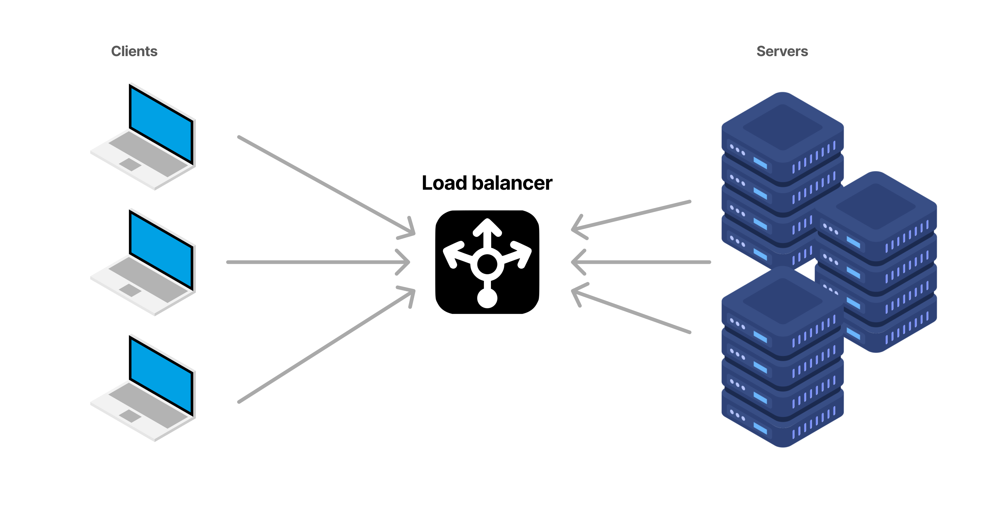

# Build LoadBalancer in java

load balancers are critical component in distributed systems that ensures the efficient distribution of incoming requests across multiple servers.A load balancer acts as an intermediary between clients and servers, managing traffic to ensure high availability and reliability of services.



## Communication Flow

**Client Sends Request:** A client sends a request to the load balancer instead of directly contacting a specific server.

**Load Balancer Distributes Traffic:** Based on pre-configured logic, the load balancer determines which server to route the request to.

**Server Processes Request:** The selected server processes the request and returns the response to the client through the load balancer.

Sample Code: Load Balancer Implementation

Here is a sample implementation of a load balancer that supports configuration through a .properties file or runtime arguments.
```java
public class App {
  public static void main(String[] args) {
    LoadBalancer lb = new LoadBalancer(ConfigProperties.getPort());
    lb.addServers(ConfigProperties.getServers());
    ;

    /***
     * loadBalancer.addServer("localhost", 8081);
     * loadBalancer.addServer("localhost", 8082);
     */

    try {
      lb.start();
    } catch (IOException e) {
      e.printStackTrace();
    }
  }
}
```

### Running the Load Balancer
**Using Gradle**

- To run the load balancer using Gradle:
```
gradle run -Dconfig=config.properties
```

#### Using JVM Arguments

- If you prefer to provide configurations directly through JVM arguments:
```java
gradle run -Dport=8080 -Dservers=http://localhost:8080,http://localhost:2030
```

- Sample Configurations
Using a .properties File

Create a config.properties file with the following content:
```
port=9090
servers=http://localhost:8080,http://localhost:2030
```

#### Run the application:
```
gradle run -Dconfig=config.properties
```


