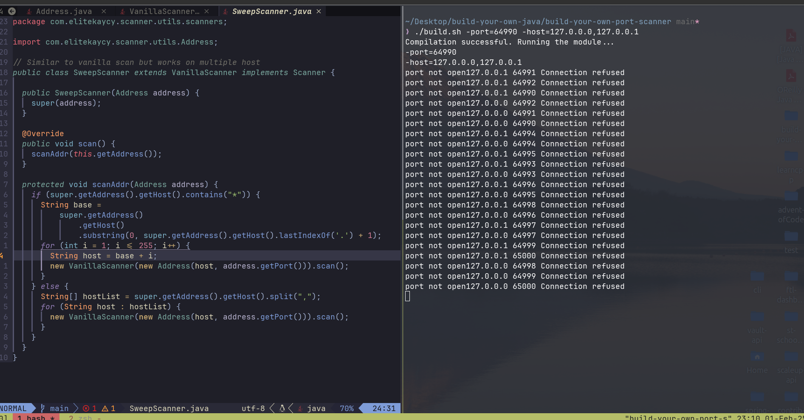

# Port Scanner Project

## Overview
A **port scanner** is a network tool used to identify open ports on a target system. It helps in security auditing, penetration testing, and network troubleshooting by detecting which services are available and accessible on a given host.

Port scanning works by sending network requests to specific ports and analyzing the responses. There are different types of port scans, each serving unique purposes:
- **Simple TCP Scan**: Establishes a full TCP connection to detect open ports.
- **Vanilla Scan**: Attempts to open a TCP connection on all 65,535 ports.
- **Sweep Scan**: Scans a specific port across multiple hosts to detect active machines.
- **SYN Scan** (Not implemented here): A stealthy scan that does not complete the full TCP handshake, making it harder to detect.

## Building My Own Port Scanner
This project includes three types of scanners:

### 1. **SimpleScanner**
- Takes a **host** and a **single port** as input.
- Attempts to establish a TCP connection.
- Reports whether the port is open or closed.

### 2. **VanillaScanner**
- Takes a **host** as input.
- Scans all **65,535 ports** on the target system.
- Uses multithreading to speed up scanning.
- Reports all open ports found on the host.

### 3. **SweepScanner**
- Takes a **port** and a **range of hosts** as input.
- Scans the same port across multiple hosts in a network.
- Identifies which hosts have that port open, useful for detecting active machines.

## Differences Between Scanners
| Scanner Type     | Scope          | Speed | Use Case |
|-----------------|---------------|------|----------|
| **SimpleScanner** | One port on one host | Fast | Checking if a specific port is open |
| **VanillaScanner** | All ports on one host | Slow (but optimized with threads) | Comprehensive port scan on a single host |
| **SweepScanner** | One port on multiple hosts | Moderate | Finding active hosts with a specific service |

## How to Run
s)

## Main Entry Point
```java
public class Main {
  public static void main(String[] args) {
    for (String arg : args) System.out.println(arg);
    Address scannerAddress = Address.createAddress(args);
    // Scanner scanner = new SimpleScanner(scannerAddress);
    // Scanner scanner = new VanillaScanner(scannerAddress);
    Scanner scanner = new SweepScanner(scannerAddress);
    scanner.scan();
  }
}
```

### Compilation & Execution
1. **Run Scanner:**
   ```sh
   ./build.sh -host=example.com -port=5432
   ```

2. **Run Scanner:**
   ```sh
   ./build.sh -port=80 -hosts=192.168.1.1,192.168.1.2,192.168.1.3
   ```


## Future Enhancements
- Implementing **SYN scanning** for stealthier scanning.
- Adding **CIDR notation support** for easier network range input.
- Improving **error handling and reporting**.



