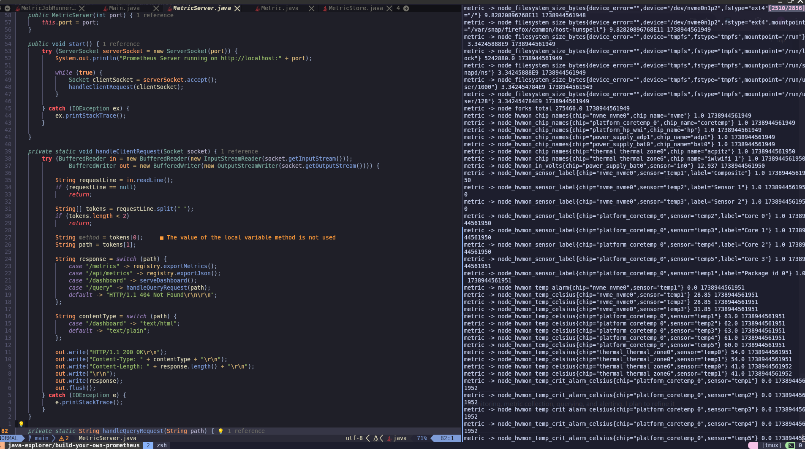
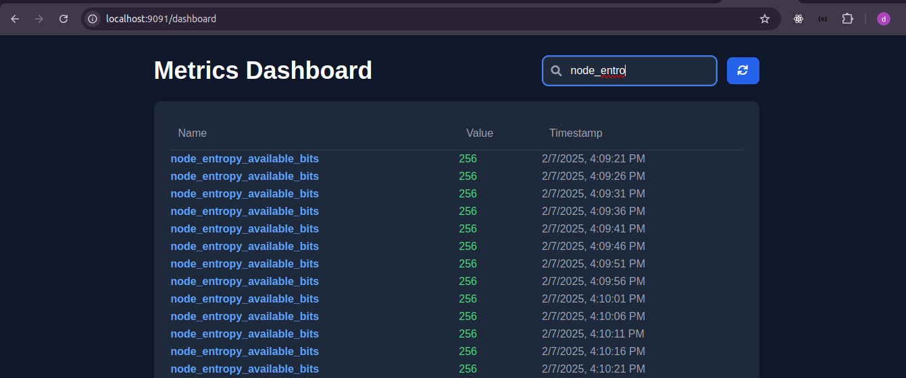
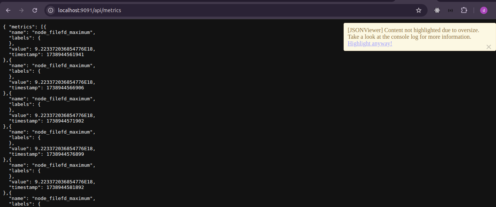
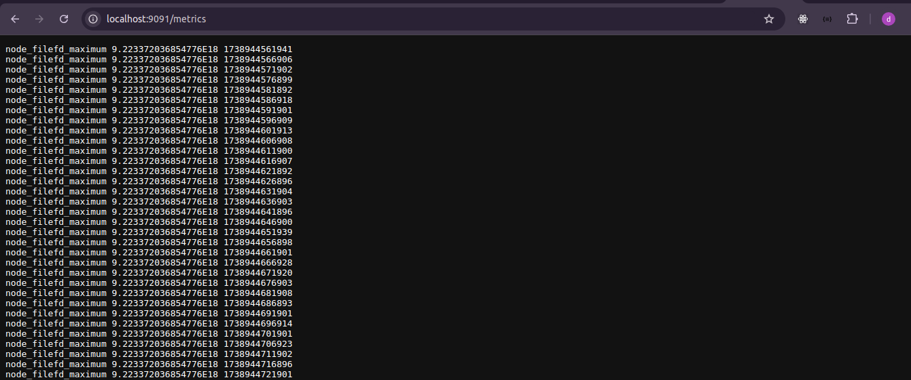

# Building Your Own Prometheus

## Introduction
Prometheus is an open-source monitoring and alerting system designed for reliability and scalability. It collects and stores time-series data, making it a widely used tool for monitoring infrastructure, applications, and services.

In this project, I set out to build a simplified version of Prometheus to gain a deeper understanding of its internal workings. This involved setting up an exporter, implementing a custom metrics storage system, designing a query engine, and building an alerting mechanism.

---

## Components of the Project
To construct this monitoring system, I broke it down into several key components:

1. **Exporter** – Collects system metrics (using Node Exporter).
2. **Configuration Management** – Loads dynamic properties from `prometheus.properties`.
3. **Metrics Server** – Scrapes and exposes collected metrics.
4. **Storage** – Stores metrics in an in-memory time-series database.
5. **Query Engine** – Supports querying collected metrics.
6. **Alerting Engine** – Detects anomalies based on threshold rules.
7. **Job Runner** – Handles periodic metric scraping.
8. **Dashboard** – A simple UI to visualize collected data.

---

## 1. Setting Up the Exporter
For metric collection, I used [Node Exporter](https://github.com/prometheus/node_exporter), which exposes system metrics such as CPU usage, memory utilization, and network stats.

I ran it as a Docker container using the pre-configured script:
```sh
./exporter.sh
```
This exposed system metrics at `http://localhost:9100/metrics`.

---

## 2. Dynamic Configuration Management
Instead of hardcoding parameters, I created a `prometheus.properties` file to configure scrape intervals, alert thresholds, and logging paths dynamically.

### Example `prometheus.properties` file:
```properties
scrape.interval=5000
metrics.port=9100
metrics.path=http://localhost:9100/metrics
port=9091
alertmanager.url=http://localhost:9093
alert.log=alerts.log
alert.type.cpu_usage=cpu_usage > 80
```

### **Loading Configuration in Java:** ([prometheus config](./main/java/com/elitekaycy/prometheus/utils/PrometheusConfig.java))
```java
private void loadConfig(String filePath) {
    Properties properties = new Properties();
    try (FileInputStream input = new FileInputStream(filePath)) {
        properties.load(input);
        this.scrapeInterval = Integer.parseInt(properties.getProperty("scrape.interval", "5000"));
        this.metricsPort = Integer.parseInt(properties.getProperty("metrics.port", "8080"));
        this.metricsPath = properties.getProperty("metrics.path", "/metrics");
        this.port = Integer.parseInt(properties.getProperty("port", "9090"));
        this.alertLog = properties.getProperty("alert.log", "alert.log");

        for (String key : properties.stringPropertyNames()) {
            if (key.startsWith("alert.type.")) {
                alertRules.add(AlertRule.parse(properties.getProperty(key)));
            }
        }
    } catch (IOException e) {
        System.err.println("Oops! Error loading config: " + e.getMessage());
    }
}
```

---

## 3. Implementing the Metrics Server
The Metrics Server fetches raw data from the Node Exporter and stores it in memory.

### **Fetching Metrics from the Exporter:**
```java
public void start() {
    try (ServerSocket serverSocket = new ServerSocket(port)) {
        System.out.println("Prometheus Server running on http://localhost:" + port);

        while (true) {
            Socket clientSocket = serverSocket.accept();
            handleClientRequest(clientSocket);
        }
    } catch (IOException ex) {
        ex.printStackTrace();
    }
}
```

Endpoints served:
```java
String response = switch (path) {
    case "/metrics" -> registry.exportMetrics();
    case "/api/metrics" -> registry.exportJson();
    case "/dashboard" -> serveDashboard();
    case "/query" -> handleQueryRequest(path);
    default -> "HTTP/1.1 404 Not Found\r\n\r\n";
};
```

---

## 4. Storing Metrics in an In-Memory Database
To store collected metrics, I implemented a time-series data store using a `HashMap`.
```java
interface MetricStore {
    void storeMetrics(Metric metric);
    List<Metric> queryMetrics(String name);
    String exportMetrics();
    String exportJson();
}
```

---

## 5. Query Engine
I implemented a simple filtering mechanism to allow querying stored metrics.
```java
public static List<Metric> filterByTimeRange(Query q) {
    return MetricStore.getInstance().queryMetrics(q.getName()).stream()
            .filter(m -> m.getTimestamp() >= q.getStart() && m.getTimestamp() <= q.getEnd())
            .collect(Collectors.toList());
}
```

---

## 6. Alerting Engine
The alerting engine checks for threshold breaches and logs alerts.

### **Alert Rule Definition:**
```properties
alert.type.cpu_usage=cpu_usage > 80
```

### **Alert Evaluation:**
```java
public static void evaluateMetrics(List<AlertRule> rules, String filePath) {
    for (AlertRule rule : rules) {
        List<Metric> metrics = MetricStore.getInstance().queryMetrics(rule.metricName);
        for (Metric metric : metrics) {
            if (isTriggered(rule, metric)) {
                logAlert("ALERT: " + rule.metricName + " exceeded " + rule.metricValue, filePath);
            }
        }
    }
}
```

---

## 7. Job Runner: Handling Periodic Metric Scraping
The `JobRunner` class is responsible for scheduling metric scraping and triggering alert evaluations.

```java
public void run() {
    scheduler.scheduleAtFixedRate(() -> {
        try {
            pull();
            AlertEngine.evaluateMetrics(config.getAlertRules(), config.getAlertLog());
        } catch (Exception ex) {
            System.out.println("Error scraping metrics: " + ex.getMessage());
        }
    }, 0, config.getScrapeInterval() / 1000, TimeUnit.SECONDS);

    Runtime.getRuntime().addShutdownHook(new Thread(() -> {
        System.out.println("Shutting down metrics scraper...");
        scheduler.shutdown();
    }));
}
```

---

## Running the Project
### **Step 1: Start the Exporter**
```sh
./exporter.sh
```
### **Step 2: Build and Start the Monitoring System**
```sh
./build.sh
```
### **Step 3: Access the Endpoints**
- Metrics: `http://localhost:9091/metrics`
- API JSON Metrics: `http://localhost:9091/api/metrics`
- Dashboard: `http://localhost:9091/dashboard`
- Query Engine: `http://localhost:9091/query`

---

## Future Improvements
- **Persistent Storage:** Implement a TSDB instead of an in-memory store.
- **Advanced Query Engine:** Introduce PromQL-like querying.
- **Visualization:** Use Grafana or a custom UI.
- **Distributed Storage:** Support sharding and replication.

---

## Conclusion
Building this Prometheus-inspired system helped me deeply understand monitoring, metric collection, querying, and alerting. I plan to refine it further with more advanced features. 🚀






