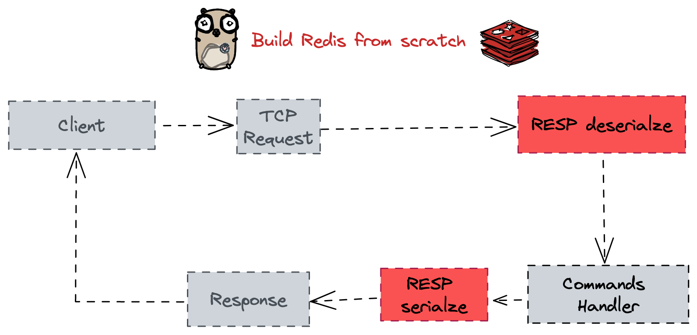
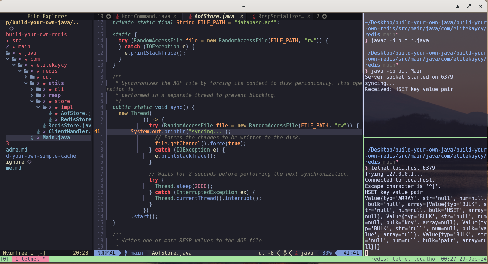

# Redis-like Java Server Implementation

This project demonstrates a simple Redis-like server built in Java. The server listens for client connections over a socket, processes commands using the RESP (Redis Serialization Protocol), and responds accordingly. It implements basic Redis commands like PING, SET, and GET, showing how to handle parsing of client input, command handling, and data serialization.
[reference to building redis in go](https://www.build-redis-from-scratch.dev/en/introduction)

## Overview of Redis

Redis is an open-source, in-memory data structure store that supports various data types, including strings, hashes, lists, sets, and more. It communicates with clients over the RESP (Redis Serialization Protocol), which defines how to format commands and responses.

- <b>RESP</b>: A binary-safe serialization protocol used by Redis for communication. It includes types like:
    - Simple Strings: Represented as strings and prefixed with <b>`+`</b>.
    - Bulk Strings: Represented by <b>`$`</b> and used for data like strings or binary data.
    - Arrays: Represented by <b>`*`</b>, which can contain multiple RESP types.
    - Integers: Represented by <b>`:`</b>, used for numeric data.

In this implementation, we handle the bulk strings and arrays for client commands.
Example RESP Message Flow



### How the Server Works

The Redis-like server follows a structured workflow to process client requests:
Step-by-Step Workflow:

- <b>Receive Input</b>: The server waits for client connections over a socket. Once a connection is made, it listens for commands sent by the client.
- <b>Parse Input</b>: The input is read as a line from the client and split into components: the command name and its arguments. The arguments are then converted into RespValue objects.
- <b>Command Handling</b>: The server looks up the command handler based on the command name (e.g., PING, SET). The appropriate handler function is invoked to process the command.
- <b>Save Data</b>: For commands like SET, data is saved in memory. For commands like GET, the server retrieves the data associated with the key.
- <b>Return Data</b>: The server returns the result back to the client, formatted according to the RESP protocol.

Sample Commands Implemented:

    PING: Responds with PONG.
    SET: Sets a key-value pair in memory.
    GET: Retrieves the value for a given key.
    HSET: Sets a hash key value pair in memory
    HGET: Retrieves the value for a given hash & key

## Data Storage (In-Memory Store)

The server uses an in-memory store with a Map<String, String> for key-value pairs and Map<String, Map<String, String>> for hash storage. An Append Only File (AOF) mechanism logs every write operation to ensure data persistence.

```
public interface RedisStore {
  void set(String key, String value);
  String get(String key);
  void hset(String key, String field, String value);
  String hget(String key, String field);
}
```

### Code Breakdown
#### 1.<b> Server Setup </b>

The server listens on port 6379 and waits for incoming client connections. For each connection, it spawns a new thread to handle the client request:

```java
public class Main {
    public static void main(String[] args) {
        try (ServerSocket serverSocket = new ServerSocket(6379)) {
            System.out.println("Server socket started on " + 6379);

            while (true) {
                Socket socket = serverSocket.accept();
                Thread thread = new Thread(new ClientHandler(socket, new CommandHandlerMapper()));
                thread.start();
            }

        } catch (IOException ignored) {
        }
    }
}
```

- <b>ServerSocket</b>: Listens for client connections.
- <b>ClientHandler</b>: A separate thread is spawned for each client connection to handle multiple clients concurrently.
CommandHandlerMapper: Maps commands to their respective handlers.

#### 2. <b>Command Handling</b>

The CommandHandlerMapper maps client commands to their respective handlers using a `Map<String, Command>`. Commands like `SET, GET, HSET, and HGET` are registered with their corresponding handler classes (e.g., SetCommand, GetCommand). When a command is received, the appropriate handler is fetched and executed, ensuring operations are performed on the in-memory store. This structure allows easy extension by adding new commands and handlers while maintaining consistent handling through the Command interface.

```java
public class CommandHandler {
  public CommandHandlerMapper() {
    this.store = RedisStoreImpl.getInstance();
    handler.put("PING", CommandHandlerMapper::ping);
    handler.put("SET", new SetCommand(this.store));
    handler.put("GET", new GetCommand(this.store));
    handler.put("HGET", new HgetCommand(this.store));
    handler.put("HSET", new HsetCommand(this.store));
  }
}
```

#### 3. <b>RESP Parser</b>

A custom parser handles the RESP input format. Here's a breakdown of the classes used for parsing:
```java
public class RespParser {
    public RespValue parse(String input) {
     switch (type) {
      case '+':
        return parseSimpleString();
      case '-':
        return parseError();
      case ':':
        return parseInteger();
      case '$':
        return parseBulkString();
      case '*':
        return parseArray();
      default:
        throw new RuntimeException("Unknown RESP type: " + type);
    }
    }
}
```
The RespParser handles:

    Bulk strings
    Arrays
    Simple strings

#### 4. <b>Client Interaction</b>

Once the server receives a command, the appropriate response is sent back to the client in the RESP format:

- For PING: The server responds with +PONG.
- For SET: The server doesn’t send a value back, but the value is saved in memory.
- For GET: The server returns the stored value for the given key.

Example Code Snippet for RESP Response Handling:
```java
public class PingCommand implements Command {

  @Override
  public RespValue execute(RespValue... args) {
    if (args.length == 0) {
      return new RespValue(RespType.SIMPLE, "PONG");
    }
    return new RespValue(RespType.BULK, args[0].bulk);
  }
}
```

#### 5. <b>Handling Multiple Clients</b>

To handle multiple clients simultaneously, the server uses threads, where each client connection is processed in a separate thread, allowing concurrent handling. Locks are implemented in critical sections, such as the AofStore class, to ensure proper thread-safe access to shared resources. This prevents race conditions during file reads and writes. Additionally, certain classes, like RespSerializer and RedisStoreImpl, are implemented as singletons to optimize memory usage and ensure consistent access to shared instances across multiple threads. This combination of threading, locks, and singletons enhances performance and ensures data integrity.
```java
public class ClientHandler implements Runnable {

    private final Socket clientSocket;
    private final CommandHandlerMapper commandHandlerMapper;

    public ClientHandler(Socket clientSocket, CommandHandlerMapper commandHandlerMapper)     {
        this.clientSocket = clientSocket;
        this.commandHandlerMapper = commandHandlerMapper;
    }

    @Override
    public void run() {}
}
```

Running the Redis-like Server

To run the Redis-like server, follow these steps:
1. Compile and run the Code:

Run the build sh file in the directory path for linux or mac or equivalent in intellij is to run the Main.java
```sh
./build.sh
```


3. Connect to the Server Using Telnet

You can use telnet to connect to the server and test it:

```sh
telnet localhost 6379
```

4. Test the Commands

Once connected, you can test the following commands:



#### Ping Command

```sh
PING
```
```sh
Expected response:
+PONG
```

#### Set Command

```sh
SET key value
```
```java
Expected response:

Value{typ: ARRAY, array = [
   Value{typ: BULK, bulk: SET},
   Value{typ: BULK, bulk: key},
   Value{typ: BULK, bulk: value},
] ...}
```

#### HSet Command

```sh
HSET key value pair
```
```java
Expected response:

Value{typ: ARRAY, array = [
   Value{typ: BULK, bulk: HSET},
   Value{typ: BULK, bulk: key},
   Value{typ: BULK, bulk: value},
   Value{typ: BULK, bulk: pair},
] ...}
```


#### database.aof
This represents how the persisted storage would look like `SET key value`
```txt
*3
$3
SET
$3
key
$5
value

```

#### Get Command
```sh
GET key

Expected response: value
```

#### Hget Command
```sh
HGET key value

Expected response: pair
```
