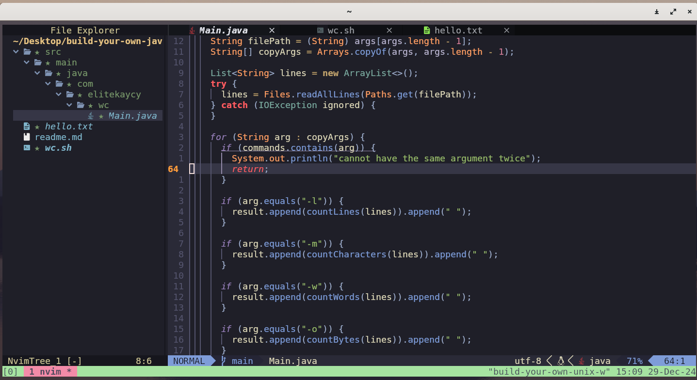

# Custom wc Implementation in Java

This is a simple Java program that mimics the functionality of the Unix-like wc (word count) command. It reads a file and calculates various statistics, such as the number of lines, words, characters, and bytes. This implementation accepts various command-line arguments to specify which statistics to compute.
Features

- Count Lines (-l): Count the number of lines in the file.
- Count Words (-w): Count the number of words in the file.
- Count Characters (-m): Count the number of characters in the file.
- Count Bytes (-o): Count the number of bytes in the file.

### Arguments

The program accepts the following arguments:
Required Argument

`<file_path>`: Path to the file that will be processed.

#### Optional Arguments

- <b>-l</b>: Count the number of lines in the file.
- <b>-m</b>: Count the number of characters in the file.
- <b>-w</b>: Count the number of words in the file.
- <b>-o</b>: Count the number of bytes in the file.

Example Usage:

    -l: Counts the lines in the file.
    -m: Counts the characters in the file.
    -w: Counts the words in the file.
    -o: Counts the bytes in the file.

You can combine any of the arguments, and the program will display the corresponding values for each.
Example Commands:

```
java Main -l -w -m file.txt
```

This will print the number of lines, words, and characters in file.txt.
Usage Notes:

```
    You cannot use the same argument twice. If you do, an error will be displayed.
    The order of the arguments does not affect the result, but the file path must be the last argument.
```

#### Running the Program
##### 1. Running in Java

Ensure you have Java 21 installed. The program supports Java 21's single-file execution feature, which allows you to run the Java file without compiling it first.
Steps to Run the Program:
```
    Open your terminal.
    Navigate to the directory containing the Main.java file.
    Run the program with the necessary arguments:
```

```
java Main -l -w -m file.txt
```

Where:

```
    -l counts lines,
    -w counts words,
    -m counts characters.
```


```bash
./wc.sh -l -w -m file.txt
```

The script will automatically run your program with the arguments provided.
Example Outputs:
Example 1: Running with -l -w -m

```java
java Main -l -w -m file.txt
```

```
Output:

3 20 120 file.txt
```

This means:

    3 lines in the file,
    20 words in the file,
    120 characters in the file.



